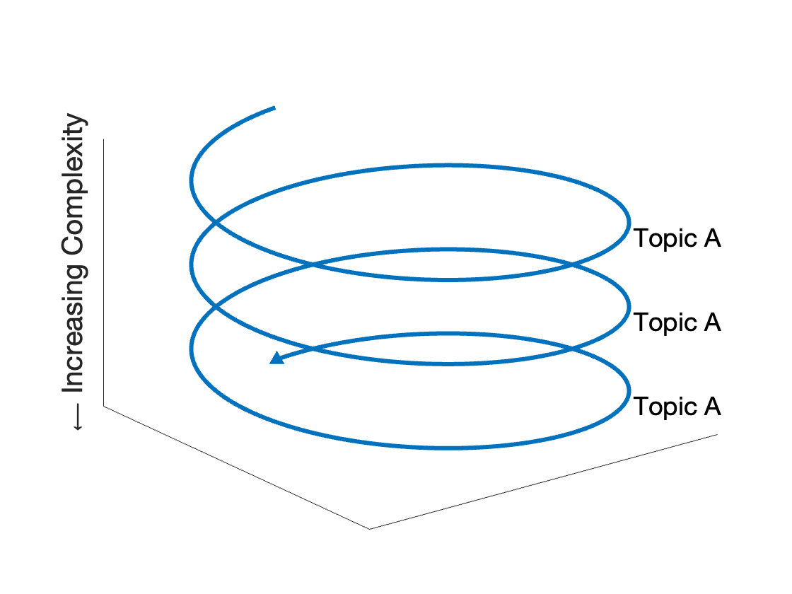

<h1>{{ page.title }}</h1>

When first approaching a complex system like the brain, it is difficult to find the best starting point, since many topics are interrelated. For that reason, these weekly webinars will be organized "corkscrew" style, revisiting the same topics but at increasing levels of complexity with each pass:

#### First Pass

| Session | Date | Topic | Notes | Slides | Video |
|---------|------|-------|-------|--------|-------|
|1|July 23, 2023|Overview| - | - | - |

#### Second Pass

| Session | Date | Topic | Notes | Slides | Video |
|---------|------|-------|-------|--------|-------|
|2|-|-| - | - | - |
|3|-|-| - | - | - |
|4|-|-| - | - | - |

#### Third Pass

| Session | Date | Topic | Notes | Slides | Video |
|---------|------|-------|-------|--------|-------|
|5|-|-| - | - | - |
|6|-|-| - | - | - |
|7|-|-| - | - | - |
|8|-|-| - | - | - |
|9|-|-| - | - | - |

#### Fourth Pass

| Session | Date | Topic | Notes | Slides | Video |
|---------|------|-------|-------|--------|-------|
|10|-|-| - | - | - |
|11|-|-| - | - | - |
|12|-|-| - | - | - |
|13|-|-| - | - | - |
|14|-|-| - | - | - |
|15|-|-| - | - | - |
|16|-|-| - | - | - |